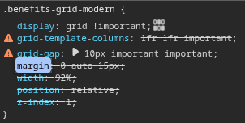

# 📝 Guía de la Vista de Requisitos

## 📋 Descripción General

La vista de requisitos es un componente diseñado para mostrar los prerrequisitos antes de iniciar un proceso. Cuenta con un diseño moderno y atractivo con diferentes secciones configurables.



## 🏗️ Estructura

La vista de requisitos está organizada en las siguientes secciones:

1. **Header con Banner**: Sección superior que incluye logotipos y permite mostrar una imagen de banner.
2. **Título y Subtítulo**: Sección informativa principal.
3. **Tarjetas de Requisitos**: Lista de requisitos mostrados con iconos y texto.
4. **Footer**: Contiene el botón de acción y la información de versión.

## 🔧 Configuración del Banner

El componente permite configurar un banner personalizado en el header:

```tsx
<RequirementsView 
  onContinue={handleContinue} 
  bannerImage="https://url-de-tu-imagen.jpg" 
/>
```

### Opciones de Banner

1. **URL Externa**: Proporciona una URL directa a la imagen.
2. **Imagen Local**: Coloca tu imagen en la carpeta `public/images/` y referencia con URL relativa.
3. **Banner Predeterminado**: Si no se proporciona imagen, se utilizará un gradiente predeterminado.

### Recomendaciones para Imágenes de Banner

- **Dimensiones**: 1200×300px (proporción 4:1)
- **Formato**: JPEG o PNG (preferentemente WebP para producción)
- **Tamaño**: Optimizar a menos de 200KB
- **Contraste**: Asegurar que el texto en blanco sea legible sobre la imagen

## 🎮 Personalización del Footer

El footer contiene tanto el botón de acción principal como la etiqueta de versión:

```tsx
<footer className="requirements-footer">
  <button className="requirements-btn" onClick={onContinue}>
    ¡Todo Listo!
  </button>
  <div className="requirements-version">Versión: 1.0.0</div>
</footer>
```

### Personalización del Botón

El botón está diseñado para:
- Mostrar texto centrado
- Tener un ancho adecuado para dispositivos móviles y desktop
- Incluir efectos interactivos al hacer hover y click
- Adaptarse responsivamente a diferentes tamaños de pantalla

## 📱 Responsividad

La vista está diseñada para adaptarse a diferentes tamaños de pantalla:

- **Móvil pequeño** (< 375px): Ajustes especiales para iconos y botones más pequeños
- **Móvil estándar** (375px - 767px): Diseño vertical optimizado
- **Tablet y Desktop** (≥ 768px): Diseño centrado con ancho máximo para contenido

## 🌈 Estilos y Temas

Los estilos están definidos en `requirements.styles.new.ts` y utilizan:

- **CSS en JavaScript**: Estilos encapsulados en strings para inyección
- **Variables dinámicas**: Uso de valores calculados con `clamp()` para responsividad
- **Efectos visuales**: Sombras, gradientes, transiciones y animaciones
- **Optimización móvil**: Ajustes específicos para diferentes tamaños de pantalla

## 🧩 Ejemplo de Integración Completa

```tsx
import React, { useState } from 'react';
import { RequirementsView } from './components/requirements/RequirementsView';

const App = () => {
  const handleContinue = () => {
    console.log('Usuario continúa al siguiente paso');
    // Lógica de navegación
  };

  return (
    <div className="app-container">
      <RequirementsView 
        onContinue={handleContinue}
        bannerImage="/images/header-banner.png" 
      />
    </div>
  );
};

export default App;
```

## 📊 Mejores Prácticas

1. **Rendimiento**: Optimizar las imágenes de banner para carga rápida
2. **Accesibilidad**: Asegurar suficiente contraste en textos e iconos
3. **Mensajes**: Mantener textos cortos y directos en los requisitos
4. **Iconos**: Usar iconos simples y representativos para cada requisito
5. **Versión**: Mantener actualizado el número de versión en el footer

## 🔄 Actualizaciones Recientes

- **v1.0.0**: Implementación inicial
- **v1.0.1**: Añadido soporte para banner personalizable
- **v1.0.2**: Mejorada la responsividad y posicionamiento del botón en footer
- **v1.0.3**: Unificado ancho del botón entre vistas para consistencia visual
- **v1.0.4**: Añadido borde a los botones para mejorar la apariencia visual

## 🔄 Consistencia Entre Vistas

Para mantener una experiencia de usuario coherente, los siguientes elementos han sido estandarizados entre vistas:

### Botones Principales

Se ha unificado el tamaño y estilo de los botones principales entre las vistas:

- **Ancho**: `clamp(180px, 45vw, 300px)` para dispositivos desktop y tablets
- **Ancho en dispositivos pequeños**: Adaptado según tamaño de pantalla
- **Centrado**: Tanto el botón como su texto están centrados
- **Borde**: Borde fino de 1px en color primario `#e91e63`
- **Animaciones**: Efectos de hover y click consistentes con cambio de color en el borde
- **Posicionamiento**: En el footer para RequirementsView, posición estratégica para PresentationView
- **Sombra**: Sutil elevación con `box-shadow: 0 6px 14px rgba(0, 0, 0, 0.08)`
